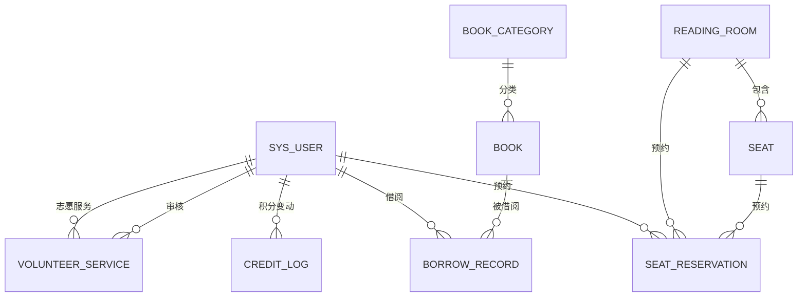

# 数据库设计文档

本文档详细描述图书馆管理系统V2.0的数据库架构设计。

## 版本信息

- 文档版本：2.0.0
- 数据库版本：MySQL 8.0+
- 最后更新：2026-04-23

---

## 目录

1. [ER图设计](#1-er图设计)
2. [表结构总览](#2-表结构总览)
3. [核心表设计](#3-核心表设计)
4. [索引设计](#4-索引设计)
5. [外键关系](#5-外键关系)
6. [表间关系图](#6-表间关系图)

---

## 1. ER图设计

### 1.1 实体定义

| 实体 | 说明 | 主键 |
|------|------|------|
| SysUser | 系统用户（管理员/馆员/读者/志愿者） | id |
| Book | 图书 | id |
| BookCategory | 图书分类 | id |
| BorrowRecord | 借阅记录 | id |
| Seat | 座位 | id |
| ReadingRoom | 阅览室 | id |
| SeatReservation | 座位预约 | id |
| CreditLog | 积分日志 | id |
| Announcement | 公告 | id |
| VolunteerService | 志愿服务 | id |
| SysOperationLog | 操作日志 | id |

### 1.2 ER图（文本表示）

```
┌──────────────┐       ┌──────────────────┐
│  SysUser     │       │   BookCategory   │
│──────────────│       │──────────────────│
│ id (PK)      │       │ id (PK)          │
│ username     │       │ name             │
│ role         │       │ parent_id (FK)───┼──────┐
│ credit_score │       └──────────────────┘      │
└──────┬───────┘                                 │
       │ 1:N                                     │
       │ ┌──────────────┐     N:1 ┌──────────────┐
       ├│ BorrowRecord  │─────────│    Book      │
       ││──────────────│         │──────────────│
       ││ id (PK)      │         │ id (PK)      │
       ││ user_id (FK) │         │ isbn         │
       ││ book_id (FK) │         │ category_id  │
       │└──────────────┘         └──────────────┘
       │
       │ 1:N
       ├──────────────┐       ┌──────────────┐
       │ SeatReserv.  │       │ ReadingRoom  │
       │──────────────│       │──────────────│
       │ id (PK)      │  N:1  │ id (PK)      │
       │ user_id (FK) │───────┤ name         │
       │ seat_id (FK) │       └──────────────┘
       │ room_id (FK) │             │
       └──────────────┘             │ 1:N
                                    ▼
       ┌──────────────┐       ┌──────────────┐
       │ CreditLog    │       │    Seat      │
       │──────────────│       │──────────────│
       │ id (PK)      │       │ id (PK)      │
       │ user_id (FK) │       │ room_id (FK) │
       └──────────────┘       └──────────────┘
```

### 1.3 关系说明

| 关系 | 实体1 | 实体2 | 关系类型 | 说明 |
|------|-------|-------|----------|------|
| 用户-借阅 | SysUser | BorrowRecord | 1:N | 一个用户可有多条借阅记录 |
| 图书-借阅 | Book | BorrowRecord | 1:N | 一本书可被多次借阅 |
| 分类-图书 | BookCategory | Book | 1:N | 一个分类包含多本书 |
| 分类-子分类 | BookCategory | BookCategory | 1:N | 分类树形结构 |
| 阅览室-座位 | ReadingRoom | Seat | 1:N | 一个阅览室包含多个座位 |
| 座位-预约 | Seat | SeatReservation | 1:N | 一个座位可有多次预约 |
| 用户-预约 | SysUser | SeatReservation | 1:N | 一个用户可有多次预约 |
| 阅览室-预约 | ReadingRoom | SeatReservation | 1:N | 一个阅览室可有多次预约 |
| 用户-积分日志 | SysUser | CreditLog | 1:N | 一个用户有多条积分变动记录 |

---

## 2. 表结构总览

| 序号 | 表名 | 说明 | 记录预估 |
|------|------|------|----------|
| 1 | sys_user | 用户表 | ~10,000 |
| 2 | book_category | 图书分类表 | ~100 |
| 3 | book | 图书表 | ~50,000 |
| 4 | borrow_record | 借阅记录表 | ~500,000 |
| 5 | reading_room | 阅览室表 | ~20 |
| 6 | seat | 座位表 | ~1,000 |
| 7 | seat_reservation | 座位预约表 | ~100,000 |
| 8 | credit_log | 积分日志表 | ~200,000 |
| 9 | announcement | 公告表 | ~500 |
| 10 | volunteer_service | 志愿服务表 | ~10,000 |
| 11 | sys_operation_log | 操作日志表 | ~500,000 |

---

## 3. 核心表设计

### 3.1 sys_user（用户表）

```sql
CREATE TABLE sys_user (
    id BIGINT PRIMARY KEY AUTO_INCREMENT,
    username VARCHAR(50) NOT NULL UNIQUE,
    password VARCHAR(255) NOT NULL,
    real_name VARCHAR(50),
    phone VARCHAR(20),
    email VARCHAR(100),
    avatar VARCHAR(255),
    role VARCHAR(20) NOT NULL DEFAULT 'READER',  -- ADMIN/LIBRARIAN/READER/VOLUNTEER
    status VARCHAR(20) NOT NULL DEFAULT 'NORMAL', -- NORMAL/DISABLED/LOCKED
    credit_score INT DEFAULT 100,
    card_number VARCHAR(20),
    borrow_count INT DEFAULT 0,
    version INT DEFAULT 0,  -- 乐观锁
    create_time DATETIME DEFAULT CURRENT_TIMESTAMP,
    update_time DATETIME DEFAULT CURRENT_TIMESTAMP ON UPDATE CURRENT_TIMESTAMP,
    deleted TINYINT DEFAULT 0,
    INDEX idx_username (username),
    INDEX idx_card_number (card_number),
    INDEX idx_role (role),
    INDEX idx_status (status)
) ENGINE=InnoDB DEFAULT CHARSET=utf8mb4;
```

**字段说明：**

| 字段 | 类型 | 说明 |
|------|------|------|
| id | BIGINT | 用户唯一标识，自增主键 |
| username | VARCHAR(50) | 用户名，唯一，用于登录 |
| password | VARCHAR(255) | BCrypt加密后的密码 |
| real_name | VARCHAR(50) | 真实姓名 |
| phone | VARCHAR(20) | 手机号 |
| email | VARCHAR(100) | 电子邮箱 |
| avatar | VARCHAR(255) | 头像URL |
| role | VARCHAR(20) | 角色：ADMIN(管理员)/LIBRARIAN(馆员)/READER(读者)/VOLUNTEER(志愿者) |
| status | VARCHAR(20) | 状态：NORMAL(正常)/DISABLED(禁用)/LOCKED(锁定) |
| credit_score | INT | 信用积分，初始100分 |
| card_number | VARCHAR(20) | 读者卡号 |
| borrow_count | INT | 当前借阅数量 |
| version | INT | 乐观锁版本号 |
| create_time | DATETIME | 创建时间 |
| update_time | DATETIME | 更新时间 |
| deleted | TINYINT | 逻辑删除标志 |

**索引设计：**
- `idx_username`：用户名字段，用于登录查询
- `idx_card_number`：读者卡号，用于读者快速查询
- `idx_role`：角色字段，用于按角色筛选
- `idx_status`：状态字段，用于按状态筛选

---

### 3.2 book（图书表）

```sql
CREATE TABLE book (
    id BIGINT PRIMARY KEY AUTO_INCREMENT,
    isbn VARCHAR(20) NOT NULL UNIQUE,
    title VARCHAR(200) NOT NULL,
    author VARCHAR(100),
    category_id BIGINT,
    publisher VARCHAR(100),
    publish_date DATE,
    price DECIMAL(10,2),
    total_quantity INT DEFAULT 1,
    stock INT DEFAULT 1,
    borrow_count INT DEFAULT 0,
    status TINYINT DEFAULT 0,  -- 0-正常, 1-下架
    description TEXT,
    cover_image VARCHAR(255),
    version INT DEFAULT 0,
    create_time DATETIME DEFAULT CURRENT_TIMESTAMP,
    update_time DATETIME DEFAULT CURRENT_TIMESTAMP ON UPDATE CURRENT_TIMESTAMP,
    deleted TINYINT DEFAULT 0,
    INDEX idx_isbn (isbn),
    INDEX idx_category_id (category_id),
    INDEX idx_title (title),
    INDEX idx_author (author),
    INDEX idx_status (status),
    FULLTEXT INDEX ft_title_author (title, author)
) ENGINE=InnoDB DEFAULT CHARSET=utf8mb4;
```

**字段说明：**

| 字段 | 类型 | 说明 |
|------|------|------|
| id | BIGINT | 图书唯一标识 |
| isbn | VARCHAR(20) | ISBN号，全局唯一 |
| title | VARCHAR(200) | 书名 |
| author | VARCHAR(100) | 作者 |
| category_id | BIGINT | 分类ID，外键 |
| publisher | VARCHAR(100) | 出版社 |
| publish_date | DATE | 出版日期 |
| price | DECIMAL(10,2) | 价格 |
| total_quantity | INT | 馆藏总数量 |
| stock | INT | 当前可借数量 |
| borrow_count | INT | 累计借阅次数 |
| status | TINYINT | 状态：0-正常，1-下架 |
| description | TEXT | 图书描述 |
| cover_image | VARCHAR(255) | 封面图片URL |

**索引设计：**
- `idx_isbn`：ISBN索引，保证去重校验
- `idx_category_id`：分类索引，支持分类查询
- `idx_title`：书名索引，支持书名搜索
- `idx_author`：作者索引，支持作者搜索
- `ft_title_author`：全文索引，支持书名+作者联合搜索

---

### 3.3 borrow_record（借阅记录表）

```sql
CREATE TABLE borrow_record (
    id BIGINT PRIMARY KEY AUTO_INCREMENT,
    user_id BIGINT NOT NULL,
    book_id BIGINT NOT NULL,
    borrow_date DATETIME NOT NULL,
    due_date DATETIME NOT NULL,
    return_date DATETIME,
    status VARCHAR(20) NOT NULL DEFAULT 'BORROWING',  -- BORROWING/RETURNED/OVERDUE
    renew_count INT DEFAULT 0,
    fine_amount DECIMAL(10,2) DEFAULT 0,
    version INT DEFAULT 0,
    create_time DATETIME DEFAULT CURRENT_TIMESTAMP,
    update_time DATETIME DEFAULT CURRENT_TIMESTAMP ON UPDATE CURRENT_TIMESTAMP,
    deleted TINYINT DEFAULT 0,
    INDEX idx_user_id (user_id),
    INDEX idx_book_id (book_id),
    INDEX idx_status (status),
    INDEX idx_borrow_date (borrow_date),
    INDEX idx_due_date (due_date)
) ENGINE=InnoDB DEFAULT CHARSET=utf8mb4;
```

**字段说明：**

| 字段 | 类型 | 说明 |
|------|------|------|
| id | BIGINT | 记录唯一标识 |
| user_id | BIGINT | 用户ID，外键 |
| book_id | BIGINT | 图书ID，外键 |
| borrow_date | DATETIME | 借阅日期 |
| due_date | DATETIME | 应归还日期 |
| return_date | DATETIME | 实际归还日期 |
| status | VARCHAR(20) | 状态：BORROWING(借阅中)/RETURNED(已归还)/OVERDUE(逾期) |
| renew_count | INT | 续借次数 |
| fine_amount | DECIMAL(10,2) | 罚款金额 |

**索引设计：**
- `idx_user_id`：用户索引，查询用户借阅记录
- `idx_book_id`：图书索引，查询图书借阅历史
- `idx_status`：状态索引，筛选特定状态的借阅记录
- `idx_due_date`：到期日索引，逾期查询

---

### 3.4 seat（座位表）

```sql
CREATE TABLE seat (
    id BIGINT PRIMARY KEY AUTO_INCREMENT,
    room_id BIGINT NOT NULL,
    seat_number VARCHAR(20) NOT NULL,
    location VARCHAR(100),
    status VARCHAR(20) DEFAULT 'AVAILABLE',  -- AVAILABLE/OCCUPIED/RESERVED/MAINTENANCE
    create_time DATETIME DEFAULT CURRENT_TIMESTAMP,
    deleted TINYINT DEFAULT 0,
    INDEX idx_room_id (room_id),
    INDEX idx_status (status)
) ENGINE=InnoDB DEFAULT CHARSET=utf8mb4;
```

**字段说明：**

| 字段 | 类型 | 说明 |
|------|------|------|
| id | BIGINT | 座位唯一标识 |
| room_id | BIGINT | 所属阅览室ID |
| seat_number | VARCHAR(20) | 座位编号，如A-01 |
| location | VARCHAR(100) | 位置描述 |
| status | VARCHAR(20) | 状态：AVAILABLE(可用)/OCCUPIED(占用)/RESERVED(已预约)/MAINTENANCE(维护中) |

---

### 3.5 seat_reservation（座位预约表）

```sql
CREATE TABLE seat_reservation (
    id BIGINT PRIMARY KEY AUTO_INCREMENT,
    user_id BIGINT NOT NULL,
    room_id BIGINT NOT NULL,
    seat_id BIGINT NOT NULL,
    reservation_date DATETIME,
    start_time DATETIME NOT NULL,
    end_time DATETIME NOT NULL,
    status VARCHAR(20) DEFAULT 'PENDING',  -- PENDING/CHECKED_IN/COMPLETED/CANCELLED/VIOLATED
    check_in_time DATETIME,
    check_out_time DATETIME,
    violation_count INT DEFAULT 0,
    version INT DEFAULT 0,
    create_time DATETIME DEFAULT CURRENT_TIMESTAMP,
    update_time DATETIME DEFAULT CURRENT_TIMESTAMP ON UPDATE CURRENT_TIMESTAMP,
    deleted TINYINT DEFAULT 0,
    INDEX idx_user_id (user_id),
    INDEX idx_room_id (room_id),
    INDEX idx_seat_id (seat_id),
    INDEX idx_status (status),
    INDEX idx_start_time (start_time),
    INDEX idx_end_time (end_time)
) ENGINE=InnoDB DEFAULT CHARSET=utf8mb4;
```

**字段说明：**

| 字段 | 类型 | 说明 |
|------|------|------|
| id | BIGINT | 预约唯一标识 |
| user_id | BIGINT | 用户ID |
| room_id | BIGINT | 阅览室ID |
| seat_id | BIGINT | 座位ID |
| reservation_date | DATETIME | 预约日期 |
| start_time | DATETIME | 开始时间 |
| end_time | DATETIME | 结束时间 |
| status | VARCHAR(20) | 状态：PENDING(待签到)/CHECKED_IN(已签到)/COMPLETED(已完成)/CANCELLED(已取消)/VIOLATED(违约) |
| check_in_time | DATETIME | 签到时间 |
| check_out_time | DATETIME | 签退时间 |
| violation_count | INT | 违约次数 |

---

## 4. 索引设计

### 4.1 索引统计

| 表名 | 索引数量 | 索引字段 |
|------|----------|----------|
| sys_user | 4 | username, card_number, role, status |
| book | 6 | isbn, category_id, title, author, status, ft_title_author |
| borrow_record | 5 | user_id, book_id, status, borrow_date, due_date |
| reading_room | 1 | status |
| seat | 2 | room_id, status |
| seat_reservation | 6 | user_id, room_id, seat_id, status, start_time, end_time |
| credit_log | 3 | user_id, change_type, create_time |
| announcement | 2 | status, publish_time |
| volunteer_service | 3 | user_id, status, service_date |
| sys_operation_log | 4 | module, user_id, create_time, operation |

### 4.2 索引优化原则

1. **前导列原则**：复合索引的第一列应为最常用的查询条件
2. **选择性问题**：在选择性高的字段上建索引
3. **避免冗余**：不在已建索引的字段上重复建索引
4. **覆盖索引**：尽量让查询覆盖索引，减少回表

---

## 5. 外键关系

### 5.1 外键定义

| 子表 | 子表字段 | 父表 | 父表字段 | 删除策略 |
|------|----------|------|----------|----------|
| book | category_id | book_category | id | SET NULL |
| borrow_record | user_id | sys_user | id | RESTRICT |
| borrow_record | book_id | book | id | RESTRICT |
| seat_reservation | user_id | sys_user | id | RESTRICT |
| seat_reservation | room_id | reading_room | id | RESTRICT |
| seat_reservation | seat_id | seat | id | RESTRICT |
| credit_log | user_id | sys_user | id | RESTRICT |
| volunteer_service | user_id | sys_user | id | RESTRICT |
| volunteer_service | reviewer_id | sys_user | id | SET NULL |

### 5.2 外键约束说明

- **RESTRICT**：阻止删除有依赖关系的记录
- **SET NULL**：删除父记录时将子记录的外键设为NULL
- **CASCADE**：删除父记录时级联删除子记录（本系统未采用）

---

## 6. 表间关系图

### 6.1 Mermaid ER图



### 6.2 依赖关系

```
SysUser (用户)
  ├── BorrowRecord (借阅记录) ─── Book (图书) ─── BookCategory (分类)
  ├── SeatReservation (座位预约) ─── Seat (座位) ─── ReadingRoom (阅览室)
  ├── CreditLog (积分日志)
  ├── VolunteerService (志愿服务)
  └── Announcement (公告)
```

---

## 附录：分区策略

详见 [schema.sql](./backend/src/main/resources/schema.sql) 附录A：数据库分区策略说明

建议生产环境对以下表进行分区：
- `borrow_record`：按月分区
- `seat_reservation`：按月分区
- `credit_log`：按月分区
- `sys_operation_log`：按月分区
